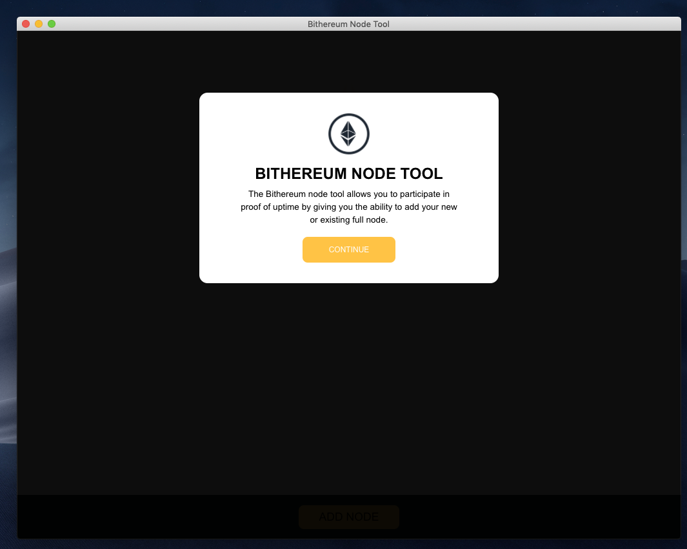
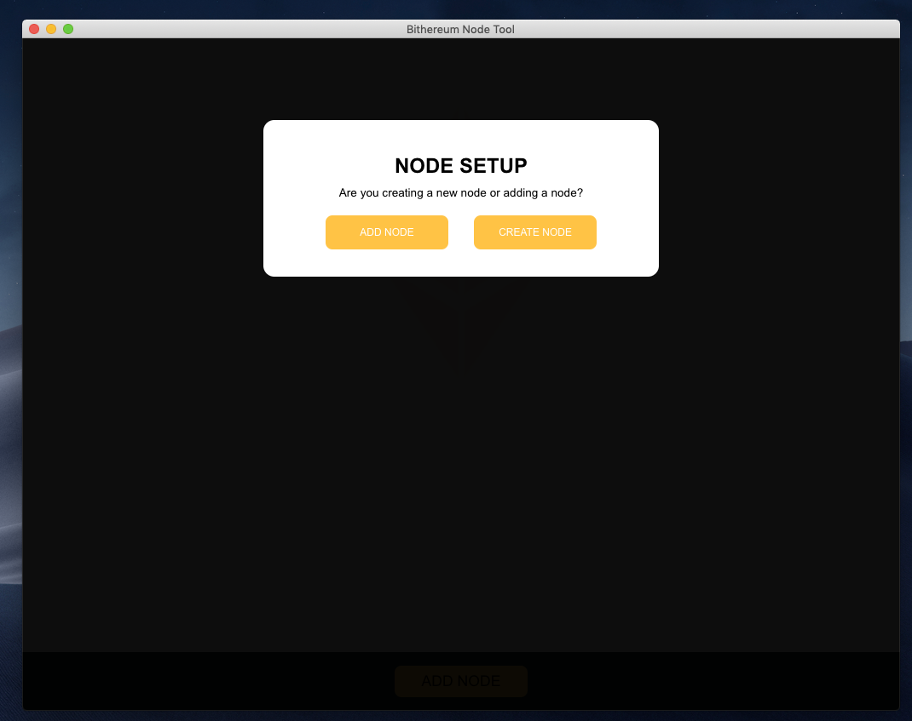
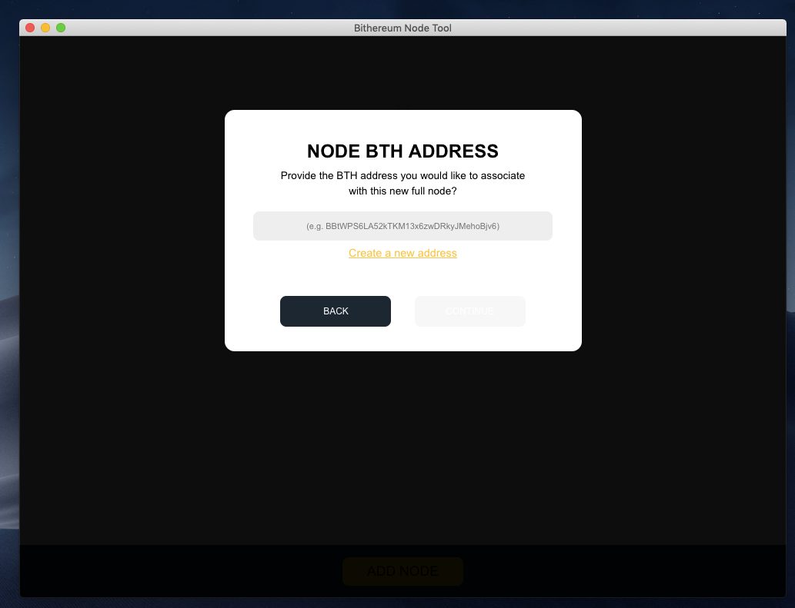
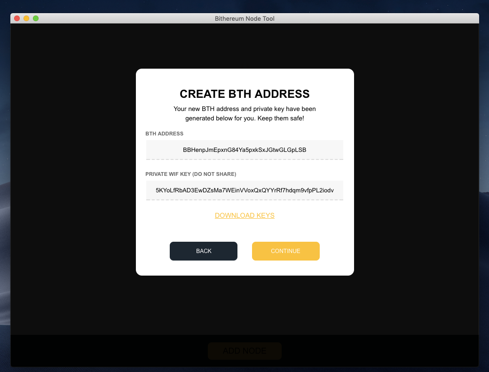
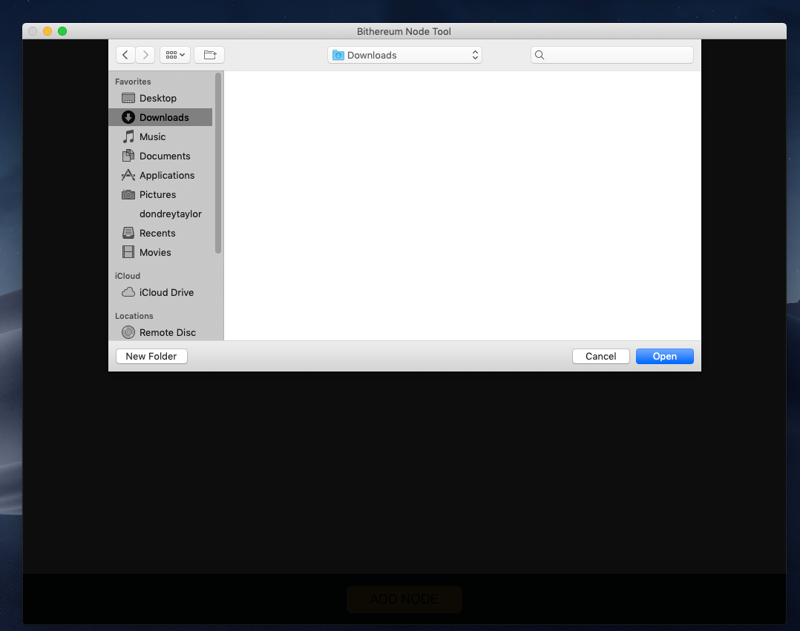
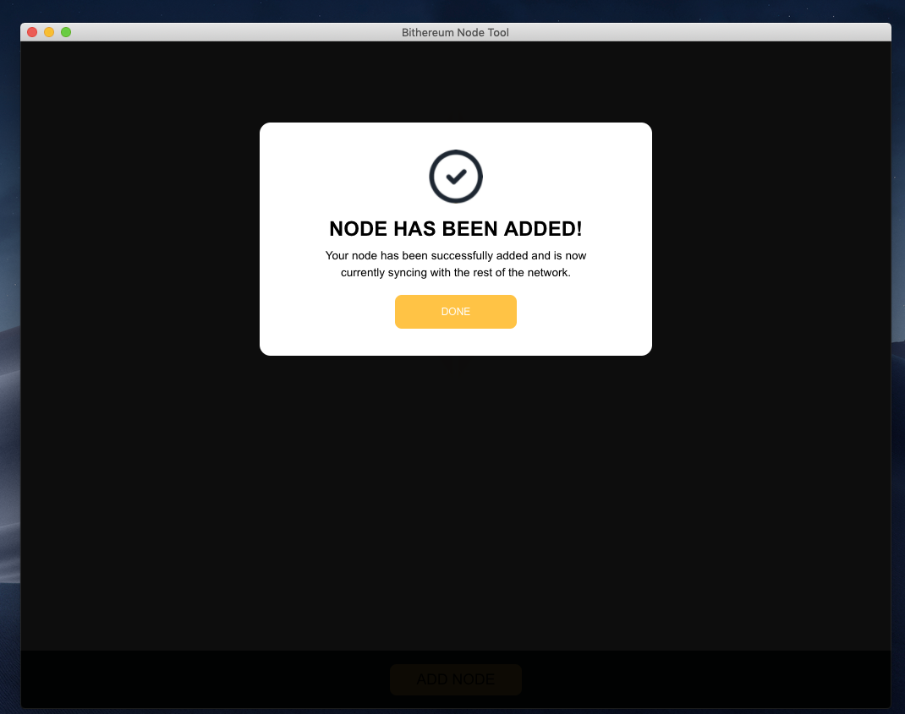

# Bithereum Node Tool

The Bithereum node tool (also referred to as "BTH Node Tool" or simply "Node Tool") is software designed to both run and manage BTH full nodes. Whether you're interested in participating in Proof-of-Uptime or need additional security, the BTH node tool makes it easy to get going with BTH full nodes in no time!

*Please Note:* All participants of Proof-of-Uptime must run at least one instance of the node tool in order to get BTH for the nodes they run.

### Using the Bithereum Node Tool

The node tool provides three functions: managing BTH nodes (e.g. tracking uptime and starting/stopping nodes), creating new BTH nodes (on the computer running the node tool), and reporting uptimes to BTH node pools. 

### Still having trouble running a full node?

If for any reason running a full node is still difficult, you can always purchase one already setup. Check out [nimbleNODE](https://nimblenode.io/), a portable node you can run from the your phone.

## What are Full nodes

A full node is a device with software responsible for verifying consensus rules and relaying transactions (usually in the form of blocks) of a particular blockchain. Running a full node is the only way to interact with a blockchain in a trustless way. Full nodes are also secure and do not suffer from the same attacks that could occur with light wallets. Furthermore, having the entire blockchain downloaded is the most private way to store, send, and receive crypto funds.

### Bithereum Full Nodes

A BTH full node is responsible for verifying and relaying Bithereum transactions throughout the network and is a critical to component to BTH peer-to-peer infrastructure.

# Why Should I run a full node?

For all the reasons you should check a full node, [check out this nice post](https://medium.com/nimblenode/everything-about-full-nodes-ba3d4431ae4c) put together by the team at nimbleNODE.
